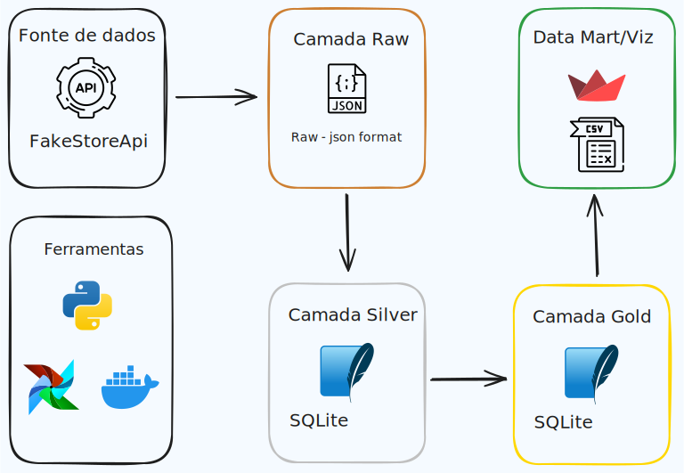

# Fake Store Data Pipeline

Este projeto de Engenharia de Dados realiza o processamento de dados da [Fake Store API](https://fakestoreapi.com/), convertendo-os para formatos utilizáveis e criando uma pipeline de dados robusta, automatizada e pronta para análise. O fluxo de trabalho abrange desde a ingestão de dados brutos até a visualização dos dados em dashboards interativos. O projeto é orquestrado com Apache Airflow e utiliza Docker para um ambiente isolado e consistente.

<p align="center">
    
</p>


## Estrutura do Projeto

O pipeline segue uma arquitetura de camadas, com os seguintes estágios:

1. **Camada Raw**: Ingestão dos dados brutos da API Fake Store e armazenamento em formato PARQUET.
2. **Camada Silver**: Transformação dos dados de PARQUET para tabelas no SQLite.
3. **Camada Gold**: Limpeza, transformação e modelagem dos dados na base SQLite, preparando-os para análise.
4. **Visualização e Exportação**: Dashboard interativo em Streamlit com indicadores-chave e opção de download dos dados em CSV.


## Tecnologias Utilizadas

- **Apache Airflow**: Orquestração do pipeline de dados.
- **SQLite**: Banco de dados utilizado para armazenar os dados transformados.
- **Streamlit**: Ferramenta para visualização dos dados e interação com o usuário.
- **Python**: Linguagem principal do projeto para integração de todas as etapas.
- **MkDocs**: Utilizado para gerar a documentação do projeto.


## Como Executar o Projeto

### Pré-requisitos

- Docker e Docker Compose instalados
- Python 3.11.*
- Poetry


### Passos para Rodar o Projeto

1. **Clone o repositório**
```bash
git clone https://github.com/pcastr/fake_store/
cd fake_store
```

2. **Instalando dependencias e ativando o ambiente**
```bash
poetry install
poetry shell
```

`
3. **Acesse o Streamlit**
* Rode o Streamlit para visualizar os dashboards e baixar os dados:
```bash
streamlit run dashboard/app.py
```

* Ou acesse Streamlit em https://fakestore.streamlit.app

## Estrutura de Pastas
```Bash
.
├── dags/                     # DAGS do Airflow
├── data/                     # Repositório de dados
│   ├── gold/
│   ├── raw/
│   └── silver/
├── docs/                     # Domumentação
├── fake_store/               # Scripts
├── mkdocs.yml
├── poetry.lock
├── pyproject.toml
├── README.md
├── app.py               # Aplicação Streamlit
└── tests/                    # Testes
```


## Documentação
A documentação do projeto será gerada utilizando o MkDocs, permitindo a criação de uma documentação rica e navegável. Para acessar a documentação localmente, execute:

```bash
mkdocs serve
```
Ou acesse a documentação em https://pcastr.github.io/fake_store
