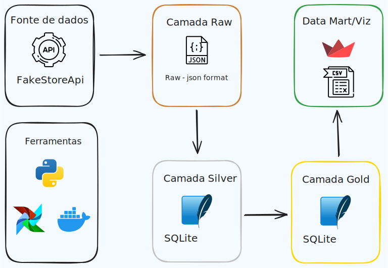

# Camada Gold

    

A **Camada Gold** representa a etapa final do nosso fluxo de dados, onde os dados extraídos da camada Silver são processados e organizados em uma tabela final, pronta para análise e relatórios. Nesta camada, focamos em consolidar informações relevantes sobre o comportamento dos usuários, gerando insights que podem ser utilizados para melhorar a experiência do cliente e otimizar as operações de e-commerce.

## Estrutura da Tabela Final

A tabela final da Camada Gold contém os seguintes campos:

- **Identificador de Usuário**: Um identificador único para cada usuário, permitindo rastrear suas atividades.
- **Contagem de Produtos no Carrinho**: O número total de produtos que cada usuário tem em seu carrinho de compras.
- **Data Mais Recente de Adição ao Carrinho**: A data e hora em que o usuário adicionou produtos pela última vez ao carrinho.
- **Categoria com Maior Quantidade de Produtos**: A categoria de produtos em que o usuário tem a maior quantidade de itens adicionados ao carrinho, proporcionando insights sobre suas preferências de compra.

Esses dados são organizados em um arquivo `.csv` que pode ser encontrado na pasta `data/marts/` ou acessado diretamente pelo https://fakestore.streamlit.app .

## Vantagens da Camada Gold

1. **Acesso Rápido a Informações Relevantes**: A tabela Gold é otimizada para consultas frequentes, permitindo que as partes interessadas acessem rapidamente informações críticas sobre o comportamento dos usuários.

2. **Suporte a Análises Avançadas**: Os dados organizados na Camada Gold facilitam a aplicação de técnicas de análise, como análise preditiva e segmentação de clientes, melhorando a tomada de decisões estratégicas.

3. **Integração com Ferramentas de Visualização**: O arquivo `.csv` gerado pode ser facilmente importado para ferramentas de visualização de dados, como Tableau ou Power BI, possibilitando a criação de dashboards e relatórios interativos.

## Considerações Finais

A Camada Gold é o culminar do nosso fluxo de dados, onde as informações são refinadas e preparadas para análise. A estrutura e a organização dos dados nesta camada são fundamentais para permitir insights valiosos que podem impulsionar decisões de negócio no e-commerce. Com o acesso facilitado aos dados, as equipes podem monitorar o desempenho e adaptar suas estratégias para melhor atender às necessidades dos clientes.

Para acessar o arquivo final, você pode navegar até a pasta `data/marts/` ou utilizar o webapp Streamlit, que fornece uma interface amigável para explorar os dados gerados.
