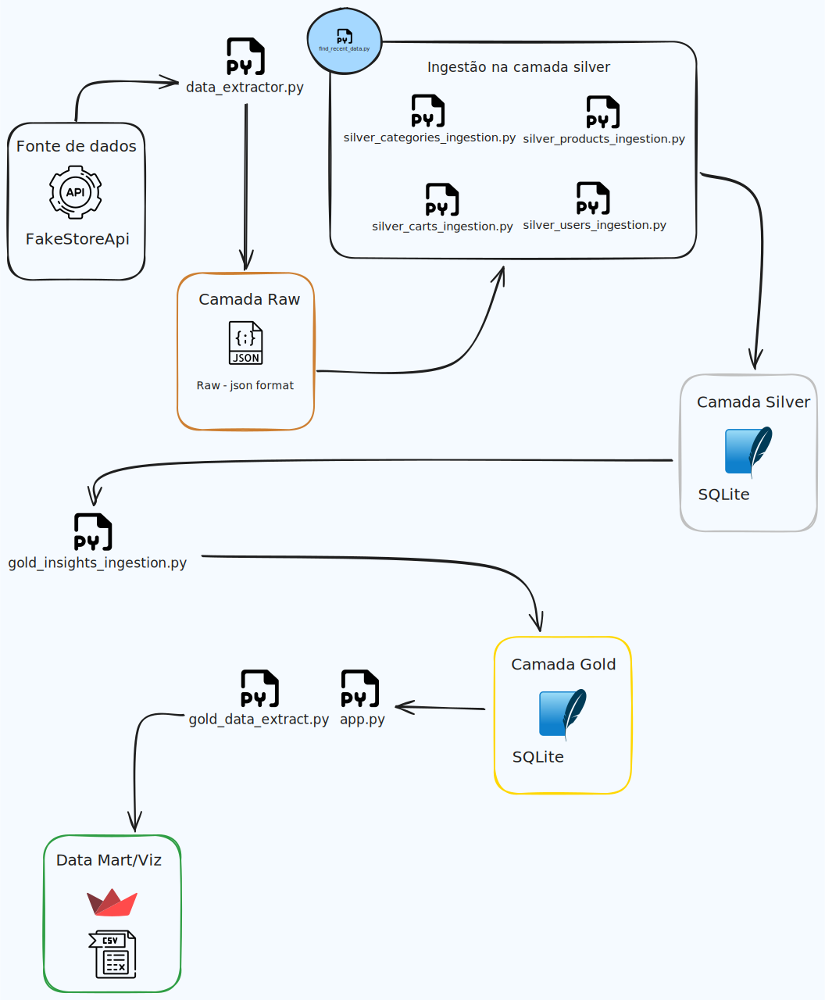

# Fake Store Data Pipeline

Este projeto de Engenharia de Dados realiza o processamento de dados da [Fake Store API](https://fakestoreapi.com/), convertendo-os para formatos utilizáveis e criando uma pipeline de dados robusta, automatizada e pronta para análise. O fluxo de trabalho abrange desde a ingestão de dados brutos até a visualização dos dados em dashboards interativos.

## Objetivos do Projeto

- **Ingestão de Dados:** Consumir dados da Fake Store API e armazená-los de forma eficiente.
- **Transformação:** Processar os dados para extrair informações relevantes sobre os usuários e seus produtos no carrinho.
- **Persistência:** Armazenar os dados transformados em um formato otimizado para consultas futuras.
- **Automatização:** Implementar o desenho de um fluxo de trabalho que será excutado diariamente.
- **Visualização:** Criar um web app utilizando Streamlit para visualização dos dados e geração de relatórios
    * O arquivo gerado deve conter:
        - identificador de usuário
        - data mais recente em que o usuário adicionou produtos ao carrinho
        - categoria em que o usuário tem mais produtos adicionados ao carrinho

# Fluxo do Projeto

    

## Estrutura do Pipeline

1. `Camada Raw`: Nesta camada, os dados brutos são armazenados em arquivos `.json` provenientes da Fake Store API. A cada execução do pipeline, um novo arquivo é gerado, permitindo o armazenamento de um histórico de extrações.

2. `Camada Silver`: Os dados brutos são transformados e armazenados em um banco de dados SQLite. Uma modelagem de dados é criada para refletir as relações necessárias, permitindo consultas eficientes.

3. `Camada Gold`: Nesta camada, os dados são desnormalizados e organizados em tabelas otimizadas para análise.

4. `Visualização`: Um web app desenvolvido com Streamlit permite que os usuários visualizem os dados e façam download de relatórios em formato CSV. Link para o webapp: https://fakestore.streamlit.app/

??? nota
    O arquivo `user_cart_insights.csv` também pode ser encontrado em: data/marts/
