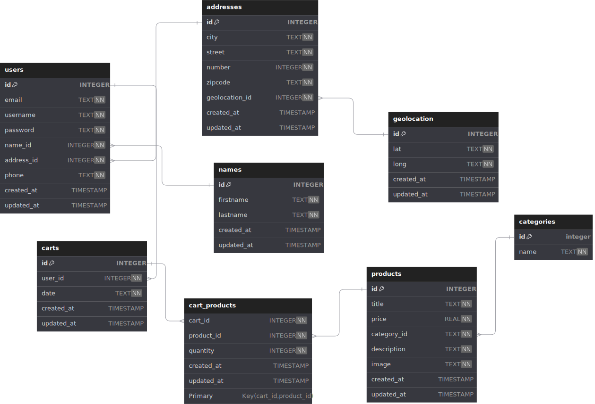

# Camada Silver

    

Depois que os dados são extraídos e salvos em `.json` na camada raw, o próximo passo é transformar esses dados para que possam ser armazenados de forma estruturada em um banco de dados na camada **Silver**.

Nesta etapa, os arquivos `.json` são processados e convertidos em tabelas, utilizando um banco de dados SQLite. O SQLite foi escolhido por ser uma solução simples e eficiente para uso local. No entanto, para projetos de grande porte, onde há necessidade de alta escalabilidade, é recomendável optar por data warehouses robustos como o **BigQuery** ou **Amazon Redshift**.

## Motivação para Utilizar a Camada Silver

A camada Silver é onde ocorre a **organização e estruturação** dos dados extraídos, com o objetivo de facilitar o acesso e a análise. Na prática, isso significa converter os dados brutos em um formato relacional, que pode ser consultado com maior eficiência. A camada Silver representa uma etapa intermediária entre os dados brutos (raw) e os dados refinados (gold), permitindo que transformações e validações básicas sejam aplicadas, como:

- **Normalização**: Estruturação dos dados em tabelas relacionadas (ex.: usuários, produtos, e carrinhos) que facilitam consultas e análises.
- **Limpeza**: Remoção de dados duplicados, inconsistentes ou irrelevantes para o propósito da análise.
- **Validação**: Verificação da integridade dos dados para garantir consistência e conformidade com o schema definido.

    

## Vantagens do SQLite para a Camada Silver

1. **Facilidade de Configuração**: O SQLite é um banco de dados leve e fácil de configurar localmente, tornando-o adequado para ambientes de desenvolvimento e testes iniciais.

2. **Desempenho Razoável para Dados Pequenos a Médios**: Para volumes moderados de dados, o SQLite oferece um desempenho satisfatório para leitura e escrita, sem a necessidade de um servidor de banco de dados.

3. **Portabilidade**: Como o SQLite armazena os dados em um único arquivo, ele pode ser facilmente movido e compartilhado entre diferentes ambientes.

## Considerações para Projetos Maiores

Para um cenário de produção em larga escala, com um grande volume de dados e altas exigências de processamento, a escolha do banco de dados precisa considerar soluções mais robustas:

- **BigQuery e Amazon Redshift**: São data warehouses otimizados para armazenar grandes volumes de dados e executar consultas complexas com alta performance. Eles suportam processamento paralelo e escalável, atendendo as necessidades de projetos de grande porte.
- **Escalabilidade e Armazenamento**: Diferente do SQLite, que é limitado para dados locais, esses data warehouses permitem o armazenamento em nuvem, possibilitando uma expansão conforme a demanda.
- **Consultas Avançadas e Análise**: BigQuery e Redshift são otimizados para análise de dados em larga escala, com suporte para SQL avançado e integração com ferramentas de BI e visualização.

### Em Resumo

A camada Silver utiliza o SQLite para fornecer uma solução prática e de baixo custo para desenvolvimento e testes iniciais. Em um ambiente de produção, recomenda-se a migração para uma solução de data warehouse que ofereça escalabilidade, segurança e suporte a grandes volumes de dados, atendendo as necessidades de um projeto em larga escala.
